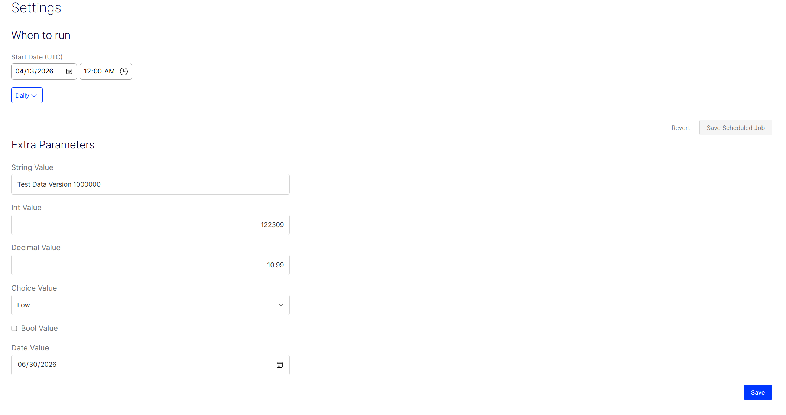
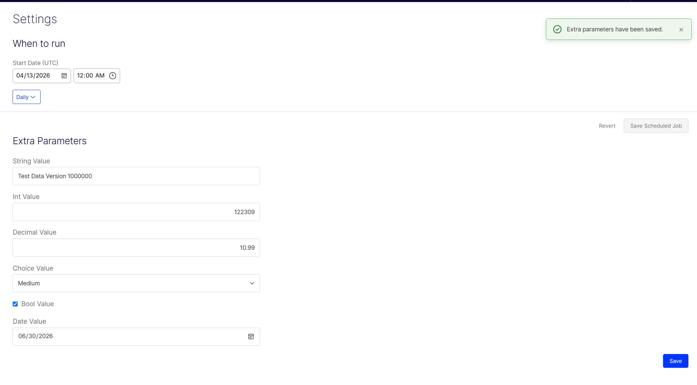

# Give your Optimizely scheduled jobs real settings — OptiScheduledJob.ExtraParameters

Optimizely (EPiServer) CMS ships a great scheduled-jobs framework, but it has one
frustrating gap: **a job has nowhere to store its own configuration**. Want an editor to
tweak a batch size, flip a feature flag, pick a priority, or set a cut-off date for a job —
without a redeploy? Out of the box you can't. Teams usually end up hard-coding values,
hanging them off `appsettings.json`, or building a one-off admin plugin for every job.

**OptiScheduledJob.ExtraParameters** closes that gap. It lets you attach a strongly-typed
settings class to any custom scheduled job and edit it **right on the job's detail page** in
the admin UI — no extra plumbing, no custom screens.

- ✅ **Edited by CMS admins** in a form rendered automatically under the job.
- ✅ **Persisted** in Optimizely's Dynamic Data Store (one record per job).
- ✅ **Read back** inside the job at execution time through a simple service.
- ✅ **Runs on CMS 12 and CMS 13** — same API, pick the matching release line.

---

## Install

The package is published to the **Optimizely NuGet feed** ([https://nuget.optimizely.com/](https://nuget.optimizely.com/)) —
not nuget.org. Register that feed as a source first:

```sh
dotnet nuget add source https://api.nuget.optimizely.com/v3/index.json -n optimizely
```

Then install the line matching your CMS — **1.x for CMS 12**, **2.x for CMS 13**:

```sh
# Optimizely CMS 12
dotnet add package OptiScheduledJob.ExtraParameters --version "[1.0,2.0)"

# Optimizely CMS 13
dotnet add package OptiScheduledJob.ExtraParameters --version "[2.0,3.0)"
```

Each line pins its own `EPiServer.CMS` range, so picking the wrong one fails restore with a
clear version conflict instead of breaking at runtime.

Register the module once in `Startup.cs`:

```csharp
using OptiScheduledJob.ExtraParameters.Infrastructure.Configuration;

public void ConfigureServices(IServiceCollection services)
{
    services.AddCms();
    // ...
    services.AddScheduledJobExtraParameters();
}
```

That's it — the package ships its own protected client module, so there's no manual file
copying or `module.config` editing.

---

## 1. Define your settings

Create a class deriving from `ScheduledJobExtraParametersBase` and decorate each property with
`[ExtraParametersPropertyDisplay]` for its label, help text, and (optionally) dropdown options:

```csharp
using OptiScheduledJob.ExtraParameters.Attributes;
using OptiScheduledJob.ExtraParameters.Models;

public class CleanupJobParameters : ScheduledJobExtraParametersBase
{
    [ExtraParametersPropertyDisplay(DisplayName = "Source folder", Description = "Path to scan")]
    public string SourceFolder { get; set; }

    [ExtraParametersPropertyDisplay(DisplayName = "Batch size", Description = "Items per run")]
    public int BatchSize { get; set; }

    [ExtraParametersPropertyDisplay(DisplayName = "Threshold", Description = "Minimum match score")]
    public decimal Threshold { get; set; }

    [ExtraParametersPropertyDisplay(DisplayName = "Send notifications")]
    public bool SendNotifications { get; set; }

    [ExtraParametersPropertyDisplay(DisplayName = "Run after")]
    public DateTime RunAfter { get; set; }

    // A string[] of options renders a dropdown.
    [ExtraParametersPropertyDisplay(DisplayName = "Priority", Options = new[] { "Low", "Medium", "High" })]
    public string Priority { get; set; }
}
```

## 2. Attach it to your job

`[ScheduledPlugInWithExtraParameters]` replaces the stock job attribute and takes the same
`DisplayName` / `Description` / `GUID` you already use:

```csharp
using EPiServer.Scheduler;
using OptiScheduledJob.ExtraParameters.Attributes;

[ScheduledPlugInWithExtraParameters(
    DisplayName = "Unused Image Removal",
    ExtraParameterDefinition = typeof(CleanupJobParameters))]
public class UnusedImageRemovalJob : ScheduledJobBase
{
    // ...
}
```

Under the hood it extends `ScheduledPlugInAttribute` on CMS 12 and `ScheduledJobAttribute` on
CMS 13 — CMS 13 obsoleted the former — but that's invisible from your code: the same job class
compiles on both.

## How it looks in the admin

Open **Admin → Scheduled Jobs → your job**. Below the standard "When to run" controls, an
**Extra Parameters** form appears automatically. Each property is rendered with the right
input control for its type — text box, number, date picker, checkbox or dropdown — one per row:



The control is chosen from the property's runtime type:

| Property type | Rendered as |
|---|---|
| `string` | text box |
| `int` / `long` / other integer types | number input |
| `decimal` / `double` / `float` | number input (decimals allowed) |
| `DateTime` | date picker |
| `bool` | checkbox |
| any property with `Options` | dropdown |

## 3. Read the values when the job runs

Inject `IScheduledJobExtraParametersDataService` and load the saved settings by the job's id:

```csharp
using OptiScheduledJob.ExtraParameters.Services;

public class UnusedImageRemovalJob : ScheduledJobBase
{
    private readonly IScheduledJobExtraParametersDataService _extraParameters;

    public UnusedImageRemovalJob(IScheduledJobExtraParametersDataService extraParameters)
    {
        _extraParameters = extraParameters;
    }

    public override string Execute()
    {
        var settings = _extraParameters.Get<CleanupJobParameters>(this.ScheduledJobId);
        var batchSize = settings?.BatchSize ?? 100;
        // ... use the settings
        return "Done";
    }
}
```

## Saving — with feedback

Hit **Save** on the Extra Parameters form and the values are posted back, converted to their
CLR types and stored. You get a clear toast notification confirming the result:



Values are written to the Dynamic Data Store as a JSON blob — one row per scheduled job
instance — so they survive restarts and are read straight back the next time the job runs.

---

## Compatibility

| Package version | Optimizely CMS | .NET                   |
| --------------- | -------------- | ---------------------- |
| **1.x**         | 12.x           | 6.0 / 8.0 / 9.0 / 10.0 |
| **2.x**         | 13.x           | 10.0                   |

Upgrading a site from CMS 12 to CMS 13? Bump the package to 2.x alongside the `EPiServer.*`
packages and leave your own code untouched — namespaces, type names and the stored data are
identical, so saved parameter values are read straight back.

## Links

- NuGet: **Optimizely NuGet feed** — https://nuget.optimizely.com/
- Source & issues: https://github.com/binhboong1802/optimizely-scheduledjob-extraparameters
- License: MIT

---

*Built by Binh Nguyen.*
